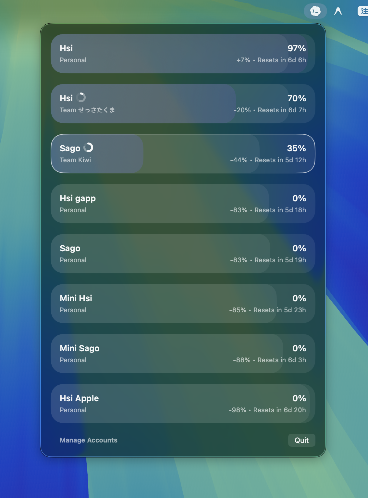

# CodexMux



A macOS menu bar app to track and sort your Codex account limits at a glance.

## Features

- Reads Codex sessions from `~/.codex/auth.json`
- Automatically discovers and tracks accounts
- Ranks accounts by usage pressure and nearest reset
- Supports nicknames to keep email addresses off-screen

## Development

Run directly:

```bash
swift run CodexMux
```

Build the native macOS app bundle:

```bash
./scripts/build-app.sh
open CodexMux.app
```

`scripts/build-app.sh` now generates a native Xcode project from `project.yml`,
builds the app with `xcodebuild`, and refreshes the repo-root `CodexMux.app`.

## Packaging

Build a Homebrew release archive and cask:

```bash
./scripts/package-homebrew.sh --version 1.0.0 --repo YOUR_GITHUB_OWNER/CodexBoard
```
